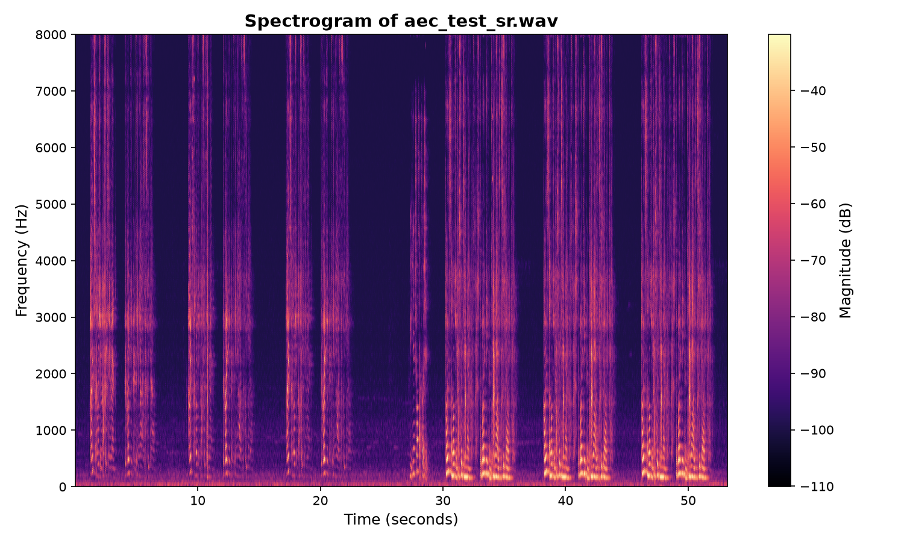

# DSP Toolkit — Audio Signal Processing Fundamentals in Modern C++
[](https://github.com/ph0123/DSP-Fundamentals-Toolkit/actions/workflows/ci.yml)

From-scratch implementations of the core building blocks of real-time audio
processing — no external DSP libraries. Built as a learning-in-public project
to go deep on the fundamentals behind speech and communication systems.



## What's inside

| Module | File | Notes |
|---|---|---|
| WAV I/O | `include/dsp/wav.hpp` | 16-bit PCM mono reader/writer |
| FFT | `include/dsp/fft.hpp` | Iterative radix-2 Cooley–Tukey, in-place, O(N log N) |
| STFT / iSTFT | `include/dsp/stft.hpp` | Hann window, overlap-add reconstruction with COLA normalization |
| Biquad filters | `include/dsp/biquad.hpp` | RBJ Audio EQ Cookbook (low-pass / high-pass), Direct Form II Transposed |
| Adaptive filter | `include/dsp/nlms.hpp` | NLMS — demonstrated on acoustic echo cancellation |
| Ring buffer | `include/dsp/ring_buffer.hpp` | Lock-free SPSC, safe for real-time audio callbacks |
| Data | `data/*.wav` | AEC test clips from Espressif's [esp-sr](https://docs.espressif.com/projects/esp-sr/en/latest/esp32/acoustic_echo_cancellation/README.html) — 16 kHz, 16-bit mono |


## Demos

All demo outputs are written to [`results/`](results/) (checked in, so you can
inspect them without building).

```bash
mkdir build && cd build
cmake .. && make

# 1. Spectrogram of a speech file (writes a raw PGM image — see below for a PNG)
./demo_spectrogram ../data/aec_test_sr.wav ../results/spectrogram.pgm

# 2. 100 Hz high-pass filter (removes rumble/DC — first block of any speech pipeline)
./demo_filter ../data/aec_test_sr.wav ../results/filtered.wav

# 3. Acoustic echo cancellation on a simulated echo path.
#    Writes mic_echo.wav (before) and echo_cancelled.wav (after) so you can A/B
#    them, and prints ERLE. Listen to both — the echo audibly disappears.
./demo_aec ../data/aec_in_far.wav ../results/mic_echo.wav ../results/echo_cancelled.wav
```

## Tuning on your own data

Every demo takes the DSP object's parameters as optional trailing arguments, so
you can experiment on your own WAV files (16-bit PCM mono) without recompiling.
Each run prints the configuration it used.

```bash
# demo_filter  in.wav out.wav [hp|lp] [cutoff_hz] [q]
./demo_filter in.wav out.wav lp 3400          # 3.4 kHz low-pass (telephone band)
./demo_filter in.wav out.wav hp 300 2.0       # 300 Hz high-pass, resonant (Q=2)

# demo_spectrogram  in.wav out.pgm [frame_size] [hop_size] [range_db]
./demo_spectrogram in.wav out.pgm 1024 256    # finer frequency resolution
./demo_spectrogram in.wav out.pgm 256 64      # finer time resolution

# demo_aec  far.wav mic.wav out.wav [taps] [mu] [eps]
./demo_aec far.wav mic.wav out.wav 1024 1.0   # longer filter, faster adaptation
./demo_aec far.wav mic.wav out.wav 256 0.3    # shorter, slower, more stable
```

| Demo | Parameter | Meaning / trade-off |
|---|---|---|
| `demo_filter` | `type` | `hp` (high-pass) or `lp` (low-pass) |
| | `cutoff_hz` | −3 dB corner frequency |
| | `q` | resonance; 0.7071 = maximally flat (Butterworth) |
| `demo_spectrogram` | `frame_size` | ↑ = finer frequency, coarser time (power of 2) |
| | `hop_size` | step between frames; smaller = more overlap |
| | `range_db` | dynamic range shown in the image |
| `demo_aec` | `taps` | filter length — must cover the echo tail |
| | `mu` | step size (0<μ<2); bigger = faster but jitterier |
| | `eps` | regularizer floor; too small → divergence |

## Visualizing the spectrogram

`demo_spectrogram` writes a `.pgm` (portable graymap) with no external
dependencies — quick, but most image viewers won't open it directly. For the
labelled, colour-mapped image shown at the top of this README
([`results/spectrogram.png`](results/spectrogram.png)), use the Python helper
(which reads the WAV directly and computes its own STFT):

```bash
python3 -m venv .venv
source .venv/bin/activate
pip install -r scripts/requirements.txt
python3 scripts/plot_spectrogram.py data/aec_test_sr.wav results/spectrogram.png
```

## Results

Reproduced by the commands above (16 kHz test clips, `-O2`):

- **Echo cancellation: ≈ 47 dB ERLE** after convergence, on a simulated
  3-reflection echo path with a −80 dB measurement-noise floor
  (512-tap NLMS, μ = 0.7). `mic_echo.wav` → `echo_cancelled.wav` drops from
  audible echo to near-silence.
- **FFT round-trip** `ifft(fft(x)) − x`: max error **≈ 8×10⁻⁶** (N = 1024,
  single-precision).
- **STFT → iSTFT reconstruction**: max interior error **≈ 2×10⁻⁶**
  (512-point Hann, hop 128, COLA-satisfied).

## Why from scratch?

Libraries like FFTW or KissFFT are obviously what you'd use in production.
The point here was to be able to answer *why*, not just *how*:

- **FFT** — why divide-and-conquer over even/odd samples turns O(N²) into
  O(N log N), and why a real input signal only needs N/2+1 bins
  (conjugate symmetry).
- **Windowing** — why cutting a signal into frames without a window causes
  spectral leakage, and what the Hann window trades away for it.
- **Overlap-add** — why the analysis/synthesis windows and hop size must
  satisfy the COLA condition for perfect reconstruction.
- **IIR vs FIR** — biquads are cheap (5 multiplies/sample) but have
  non-linear phase; FIR gives linear phase at much higher cost.
- **NLMS** — why normalizing the update by the reference-signal energy makes
  convergence speed independent of input level, why the regularizer `δ` is a
  *floor* (not just a divide-by-zero guard — too small and the filter diverges
  when the reference goes quiet), and why echo cancellation is fundamentally
  *easier* than noise suppression: you have a reference signal for what the
  loudspeaker played. It's only easy in *single-talk*, though — when both ends
  talk at once ("double-talk"), the adaptive filter starts fitting the near-end
  speech and cancellation falls apart, which is why real systems add a
  double-talk detector to freeze adaptation.

## Requirements

- **C++ core:** C++17, CMake ≥ 3.16 — no external dependencies.
- **Spectrogram plotting (optional):** Python 3 with `numpy`, `scipy`,
  `matplotlib` — see [scripts/requirements.txt](scripts/requirements.txt).

## License

MIT
